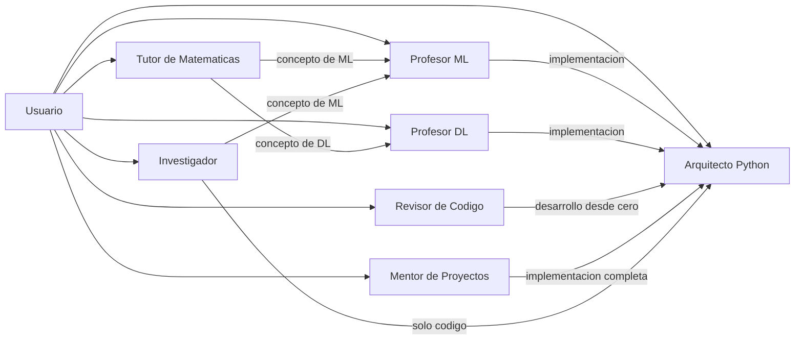

# Ecosistema de Asistentes IA Locales

[](https://github.com/CristianLra/ecosistema-asistentes-ia/actions/workflows/validacion.yml)
[](./LICENSE)

Conjunto de **7 asistentes especializados** que corren localmente mediante [Ollama](https://ollama.com). Cada asistente tiene un rol definido y deriva las tareas fuera de su alcance al asistente adecuado del mismo ecosistema.

---

## Caracteristicas

- **Especializacion:** cada asistente tiene un unico rol (ensenanza, revision de codigo, planificacion, etc.).
- **Derivacion automatica:** cuando un asistente recibe una tarea que no le corresponde, indica explicitamente cual es el asistente adecuado.
- **Ejecucion local:** los modelos corren en tu maquina con Ollama. Sin dependencias de servicios externos.
- **Pruebas automatizadas:** runner con criterios verificables por maquina que genera reportes reproducibles.
- **Documentacion completa:** especificaciones, changelogs, decisiones de arquitectura y roadmap por cada asistente.

---

## Por que este enfoque

### Por que asistentes especializados en vez de uno generalista

Un modelo generalista intenta resolver todo: ensenar ML, revisar codigo, planificar proyectos. Esto genera respuestas superficiales en dominios especificos. Con asistentes especializados, cada uno profundiza en su area y conoce sus limites.

### Por que Ollama y no una API

- **Privacidad:** los datos no salen de tu maquina.
- **Sin costo:** no hay facturacion por tokens.
- **Sin internet:** funciona completamente offline una vez descargados los modelos.
- **Control total:** puedes modificar los prompts, la temperatura y el comportamiento de cada asistente.

### Por que dos modelos base

| Modelo | Uso | Por que |
|--------|-----|---------|
| `gemma3:4b` | Asistentes educativos (Profesor ML, Profesor DL, Tutor de Matematicas) | Sigue mejor las instrucciones y mantiene personalidad mas consistente |
| `qwen2.5-coder:3b` | Asistentes de codigo (Arquitecto Python, Revisor de Codigo) | Genera mejor codigo y soluciones tecnicas |

---

## Asistentes

| Asistente | Rol | Modelo |
|-----------|-----|--------|
| Profesor ML | Ensenanza de Machine Learning | gemma3:4b |
| Profesor DL | Ensenanza de Deep Learning | gemma3:4b |
| Tutor de Matematicas | Matematicas y fundamentos | gemma3:4b |
| Arquitecto Python | Implementacion de codigo | qwen2.5-coder:3b |
| Revisor de Codigo | Analisis y revision de codigo | qwen2.5-coder:3b |
| Mentor de Proyectos | Planificacion y seguimiento | gemma3:4b |
| Investigador | Comparacion y analisis tecnico | qwen2.5-coder:3b |

### Patron de derivacion



Cada asistente deriva al especialista correcto. Por ejemplo, si le preguntas al Revisor de Codigo "creame una API completa", te derivara al Arquitecto Python en lugar de intentar hacerlo el.

---

## Resultados

| Asistente | Pruebas | Estado |
|-----------|---------|--------|
| Tutor de Matematicas | 5/5 | Estable |
| Profesor DL | 4/4 | Estable |
| Profesor ML | 4/4 | Estable |
| Mentor de Proyectos | 4/4 | Estable |
| Investigador | 4/4 | Estable |
| Revisor de Codigo | 4/4 | Estable (v1.3) |
| Arquitecto Python | 2/3 | Limitacion conocida (ver [versiones](documentacion/versiones.md)) |

**Total: 27/28** -- Corrida del 2026-08-12 a temperatura 0.0.

El unico fallo pendiente es una limitacion conocida del Arquitecto Python: ante preguntas conceptuales directas de ML (ej. "que es el overfitting"), explica el concepto en vez de derivar al Profesor ML. Se probaron dos correcciones de prompt sin exito; se atribuye al modelo base (Qwen 2.5 Coder 3B).

---

## Estructura del proyecto

```
asistentes-ia/
├── asistentes/          # Los 7 asistentes especializados
│   ├── arquitecto-python/
│   ├── investigador/
│   ├── mentor-proyectos/
│   ├── profesor-dl/
│   ├── profesor-ml/
│   ├── revisor-codigo/
│   └── tutor-matematicas/
├── documentacion/       # Documentacion general del proyecto
├── plantillas/          # Plantillas reutilizables para nuevos asistentes
├── assets/              # Demos y ejemplos para portafolio
├── pruebas/             # Sistema de pruebas automatizadas
│   ├── catalogo/        # Definicion de pruebas por asistente (JSON)
│   ├── ejecutar_pruebas.py   # Runner principal
│   ├── validar_catalogos.py  # Validador de estructura
│   └── reportes/        # Reportes generados (ignorado por git)
└── .github/workflows/   # CI con GitHub Actions
```

---

## Puesta en marcha

**Requisitos:** [Ollama](https://ollama.com) y Python 3.

### 1. Clonar el repositorio

```bash
git clone https://github.com/CristianLra/ecosistema-asistentes-ia.git
cd ecossistema-asistentes-ia
```

### 2. Descargar modelos y crear asistentes

```bash
ollama pull qwen2.5-coder:3b
ollama pull gemma3:4b

ollama create arquitecto-python -f asistentes/arquitecto-python/Modelfile
ollama create investigador -f asistentes/investigador/Modelfile
ollama create mentor-proyectos -f asistentes/mentor-proyectos/Modelfile
ollama create profesor-dl -f asistentes/profesor-dl/Modelfile
ollama create profesor-ml -f asistentes/profesor-ml/Modelfile
ollama create revisor-codigo -f asistentes/revisor-codigo/Modelfile
ollama create tutor-matematicas -f asistentes/tutor-matematicas/Modelfile
```

### 3. Probar

```bash
ollama run profesor-ml "¿Que es el overfitting?"
```

---

## Pruebas automatizadas

El runner (`pruebas/ejecutar_pruebas.py`, solo stdlib de Python) ejecuta pruebas definidas en JSON contra la API de Ollama y genera reportes reproducibles.

```bash
# Ejecutar todos los asistentes
python pruebas/ejecutar_pruebas.py

# Evaluar un asistente especifico
python pruebas/ejecutar_pruebas.py --asistente revisor-codigo

# Regenerar el resumen global desde reportes existentes
python pruebas/ejecutar_pruebas.py --solo-resumen
```

Salida de ejemplo:

```text
== Revisor de Codigo (revisor-codigo) ==
  Calentando modelo revisor-codigo...
  Prueba 001 | consultando...
  Prueba 001 | Comprobar que identifica correctamente codigo sin problemas.
  Prueba 002 | consultando...
  Prueba 002 | Evaluar la calidad de las mejoras propuestas.
  Prueba 003 | consultando...
  Prueba 003 | Evaluar el analisis de mantenibilidad sin generar una implementacion completa.
  Prueba 004 | consultando...
  Prueba 004 | Comprobar que deriva al Arquitecto Python ante una solicitud de desarrollo desde cero.
```

La guia completa esta en [`documentacion/automatizacion-pruebas.md`](documentacion/automatizacion-pruebas.md).

---

## Demo

Una conversacion real con el Profesor ML (modelo base `gemma3:4b`) esta en [`assets/ejemplo-overfitting.md`](assets/ejemplo-overfitting.md).

---

## Documentacion adicional

- [Roadmap](documentacion/roadmap.md) -- fases de evolucion del ecosistema
- [Versiones](documentacion/versiones.md) -- historial y limitaciones conocidas
- [Decisiones](documentacion/decisiones.md) -- decisiones de arquitectura documentadas
- [Metodologia de validacion](documentacion/metodologia-validacion.md) -- como se validan los asistentes
- [Glosario](documentacion/glosario.md) -- terminos y diferencias del proyecto

---

## Licencia

MIT -- Ver [`LICENSE`](LICENSE) para mas detalles.
